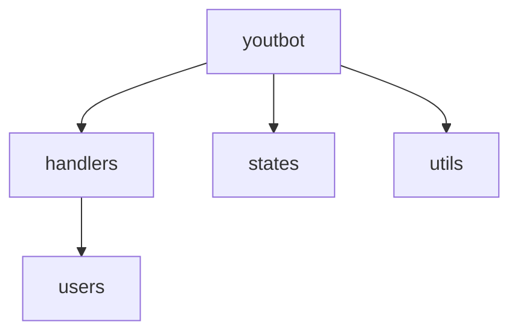

__Простой телеграм бот для загрузки музыки из ютуб__
__для работы нужно вставить токен вашего бота в файле loader.py__

Шаблон бота

- [X] Сделать тедеграм бота для загрузки видео в аудио формате
- [X] Возможность легко модифицировать и дополнять код новыми функциями
- [ ] Сделать автономную реализацию создания плей-листа в телеграмм с треками

# краское тех описания кода 

В директории handlers будут храниться все команды, которые можно использовать.

В директории states будут храниться все FSM.

App.py – это «сердце» бота. В этом файле будет инициализироваться handlers и запускаться обработка сообщений

Loader.py – сюда вынесутся все ключевые переменные бота, чтобы можно было к ним обращаться из любого пакета

